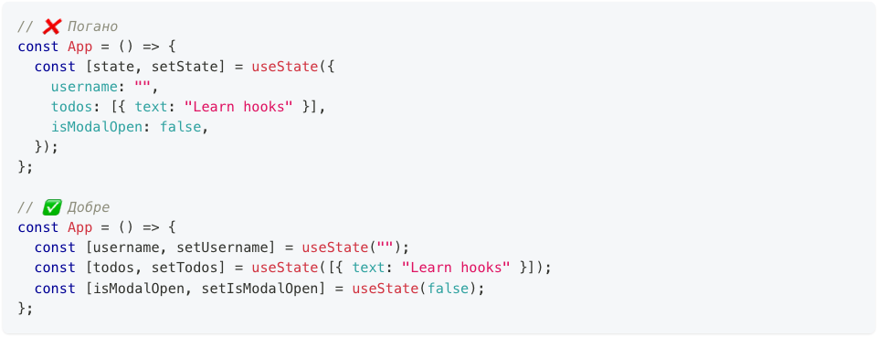
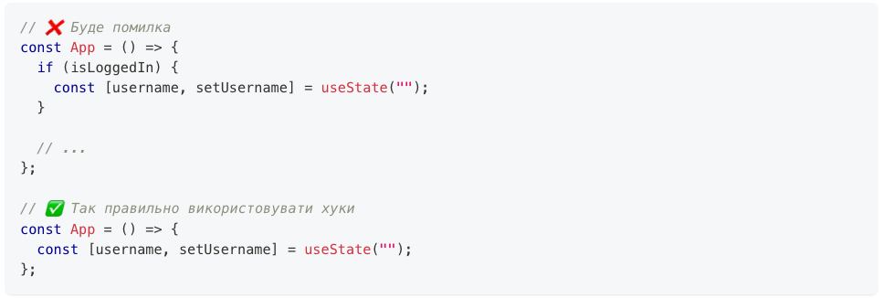
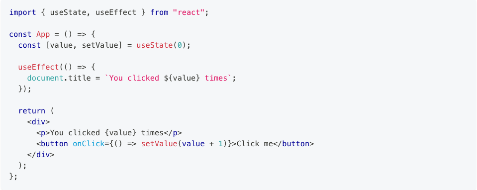
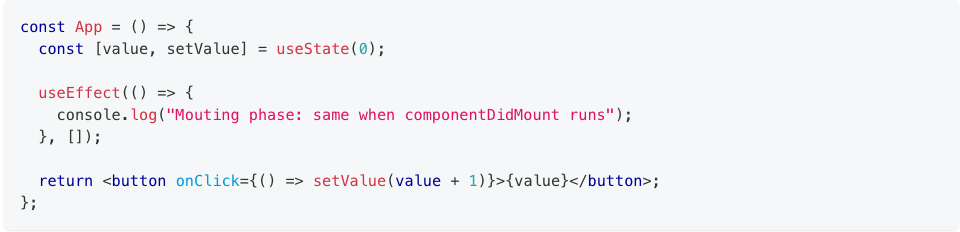
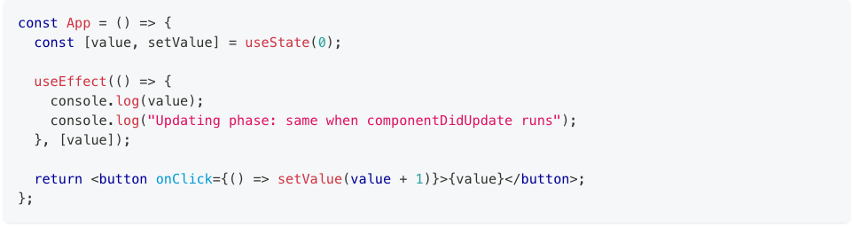
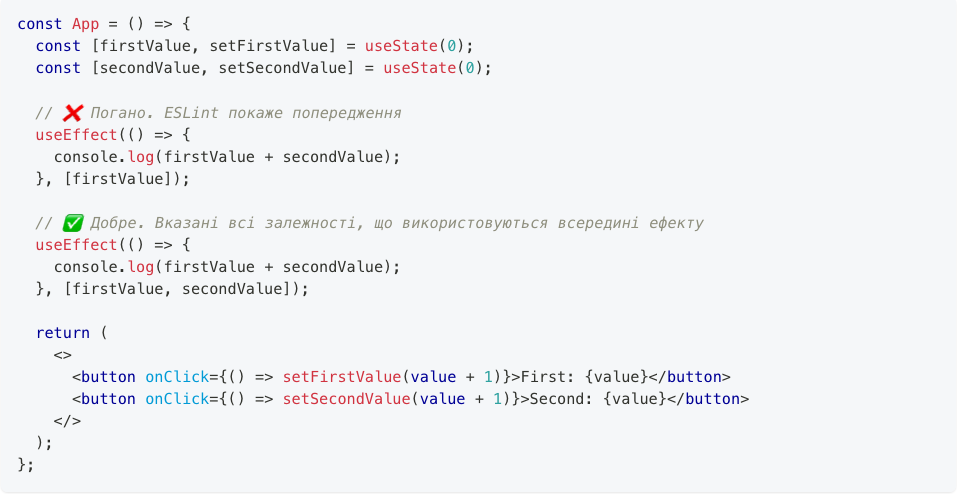
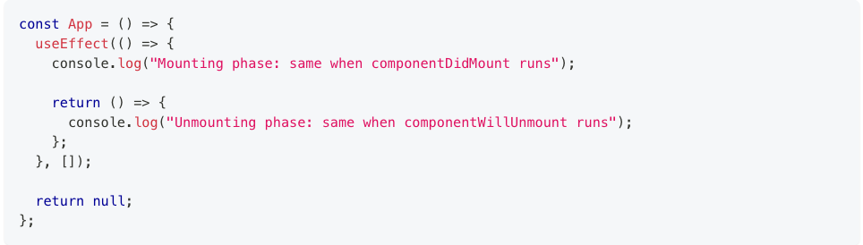
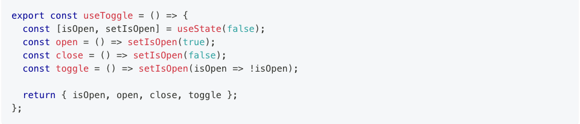

**Вступ**

https://www.w3schools.com/react/react_lifecycle.asp

**Хук useState**

**Хук useEffect**

Аналог componentDidMount

Аналог componentDidUpdate

Список залежностей

Аналог componentWillUnmount

**Власні хуки**

На прикладі useToggle

